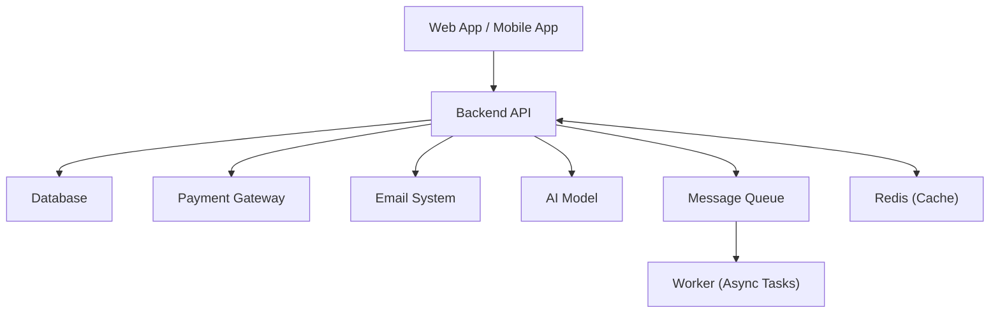
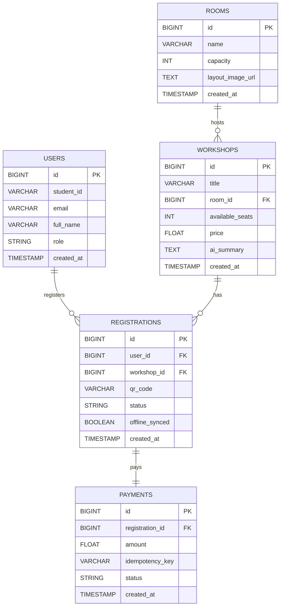

# UniHub Workshop - Technical Design

## Kiến trúc tổng thể
- Architectural Style: Event-Driven Serverless Architecture.

- Lý do: Tận dụng khả năng tự động mở rộng (Auto-scaling) của Supabase Edge Functions để chịu tải 12.000 sinh viên trong 10 phút mà không cần quản lý server.

- Giao tiếp: Các thành phần giao tiếp qua REST API (Edge Functions) và PostgreSQL Webhooks để kích hoạt các tác vụ như gửi email thông báo sau khi đăng ký thành công.

## C4 Diagram
### Level 1 — System Context
Sơ đồ này mô tả vị trí của hệ thống UniHub Workshop trong hệ sinh thái của trường đại học và các tương tác với tác nhân bên ngoài.

- Actors:

    - Sinh viên: Xem lịch, đăng ký workshop và thực hiện thanh toán.

    - Ban tổ chức (BTC): Quản lý nội dung workshop, theo dõi số lượng và xem thống kê.

    - Nhân sự check-in: Sử dụng thiết bị di động để xác nhận sự hiện diện của sinh viên.

- Hệ thống ngoài:

    - Hệ thống quản lý sinh viên cũ: Cung cấp dữ liệu sinh viên thông qua file CSV định kỳ.

    - Cổng thanh toán: Xử lý các giao dịch đăng ký có phí.

    - Hệ thống Email/Telegram: Gửi thông báo xác nhận và mã QR.

    - AI Model (Gemini): Xử lý file PDF để tạo tóm tắt nội dung workshop.

### Level 2 — Container
Hệ thống UniHub Workshop được chia thành các container sau:

1.  Web Application (React / Next.js)
    - Dành cho: 
        - Sinh viên (xem & đăng ký workshop) 
        - BTC (admin dashboard)
    - Giao tiếp với Backend API qua HTTPS

2. Mobile Application (Flutter / React Native)
    - Dành cho nhân sự check-in
    - Hỗ trợ:
        - Quét QR
        - Check-in offline (SQLite local)
    - Đồng bộ dữ liệu với Backend khi có mạng

3. Backend API (Supabase Edge Functions)
    - Xử lý logic nghiệp vụ:
        - Đăng ký workshop
        - Thanh toán (tích hợp payment gateway)
        Sinh mã QR
        Gửi thông báo
    - Giao tiếp với:
        - Database
        - External systems (AI, Payment, Email)

4. Database (PostgreSQL - Supabase)
    - Lưu trữ:
        - Users, workshops, registrations
    - Áp dụng:
        - Row-Level Security (RLS)

5. Message Queue (Upstash QStash)

    - Xử lý bất đồng bộ:
        - Gửi email hàng loạt
        - Xử lý AI (PDF → summary)

6. Cache / Rate Limiter (Redis)

    - Lưu trữ tạm:
        - Số lượng chỗ còn lại
    - Giới hạn:
        - Rate limit API

## High-Level Architecture Diagram
- Sơ đồ này tập trung vào các luồng dữ liệu đặc biệt như đồng bộ offline và tích hợp hệ thống cũ.

- Luồng Check-in Offline: Dữ liệu quét được lưu vào Local SQLite -> App tự động retry gửi tới Edge Function khi có mạng -> Cập nhật trạng thái vào Postgres.

- Luồng Tích hợp CSV: Script định kỳ đọc file từ thư mục được export -> Làm sạch dữ liệu -> UPSERT vào bảng users để cập nhật thông tin sinh viên mới nhất.

- Luồng AI Summary: BTC upload PDF lên Supabase Storage -> Trigger gọi Edge Function -> Gửi content sang Gemini API -> Lưu bản tóm tắt vào database.

## Thiết kế cơ sở dữ liệu
Lựa chọn công nghệ
- Loại Database: Relational Database (PostgreSQL).

- Lý do: * Cần tính nhất quán dữ liệu (ACID) cực cao để xử lý tranh chấp chỗ ngồi (tránh việc 2 người cùng đặt 1 chỗ cuối cùng).

    - Hỗ trợ mạnh mẽ cho các truy vấn phức tạp và báo cáo thống kê của BTC.

    - Tận dụng Row Level Security (RLS) để phân quyền truy cập trực tiếp từ tầng dữ liệu.

## Thiết kế kiểm soát truy cập (RBAC)
Mô hình: Role-Based Access Control (RBAC) kết hợp với Row Level Security (RLS) của Postgres.

Cơ chế:

- Sinh viên: Chỉ được SELECT workshop và INSERT vào bảng registrations của chính mình.

- BTC: Có quyền ALL trên bảng workshops.

- Staff: Chỉ có quyền UPDATE cột checked_in_at thông qua một Edge Function chuyên biệt để đảm bảo an toàn.

## Thiết kế các cơ chế bảo vệ hệ thống
### Kiểm soát tải đột biến (Spike Control)
Giải pháp: Sử dụng thuật toán Fixed Window Rate Limiting thông qua Upstash Redis.

Ngưỡng: Tối đa 5 request/phút cho mỗi user_id tại endpoint Đăng ký.

Hành vi: Trả về mã lỗi 429 Too Many Requests kèm thông báo "Hệ thống đang bận, vui lòng thử lại sau 30 giây".

### Xử lý cổng thanh toán không ổn định
Giải pháp: Áp dụng Circuit Breaker Pattern.

Trạng thái: 
- Closed: Hoạt động bình thường.

- Open: Nếu tỉ lệ lỗi thanh toán > 50% trong 2 phút, hệ thống tự động tạm ngắt kết nối với cổng thanh toán.

- Half-Open: Sau một khoảng thời gian chờ (ví dụ 30–60 giây), hệ thống chuyển sang trạng thái Half-Open và cho phép một số lượng nhỏ request thanh toán thử nghiệm đi qua:

    - Nếu các request này thành công, hệ thống chuyển lại về Closed.
    - Nếu vẫn tiếp tục lỗi, hệ thống quay lại trạng thái Open.

Hành vi:

- Khi ở trạng thái Open:
    - Sinh viên vẫn có thể xem danh sách workshop.
    - Các chức năng không liên quan đến thanh toán vẫn hoạt động bình thường.
    - Nút “Đăng ký có phí” sẽ bị vô hiệu hóa và hiển thị thông báo: “Hệ thống thanh toán đang bảo trì, vui lòng thử lại sau.”
- Khi ở trạng thái Half-Open:
    - Một số ít người dùng có thể thực hiện thanh toán (test recovery).
    - Các request còn lại vẫn bị hạn chế để đảm bảo an toàn hệ thống.

### Chống trừ tiền hai lần (Idempotency)
- Cơ chế: Client (App/Web) tạo một Idempotency-Key (thường là mã UUID) trước khi gọi API thanh toán.

- Xử lý: Backend kiểm tra key này trong bảng payments. Nếu đã tồn tại, hệ thống trả về kết quả cũ thay vì thực hiện giao dịch mới.

## Các quyết định kỹ thuật quan trọng (ADR)
- SQL (PostgreSQL) vs NoSQL: Chọn SQL vì dữ liệu đăng ký và thanh toán cần tính nhất quán tuyệt đối (ACID) để tránh tranh chấp chỗ ngồi.

- JWT vs Session: Chọn JWT (mặc định của Supabase Auth) để hỗ trợ xác thực không trạng thái (Stateless), giúp hệ thống scale dễ dàng hơn khi có tải lớn.

- Offline Check-in: Sử dụng Local SQLite (Room/SQLite) trên Mobile để lưu tạm dữ liệu quét mã QR, sau đó đồng bộ lên Supabase bằng cơ chế Retry với Exponential Backoff khi có mạng trở lại.